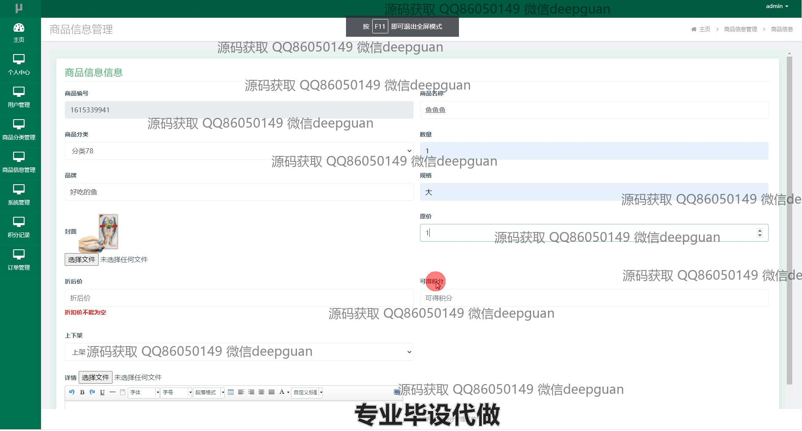
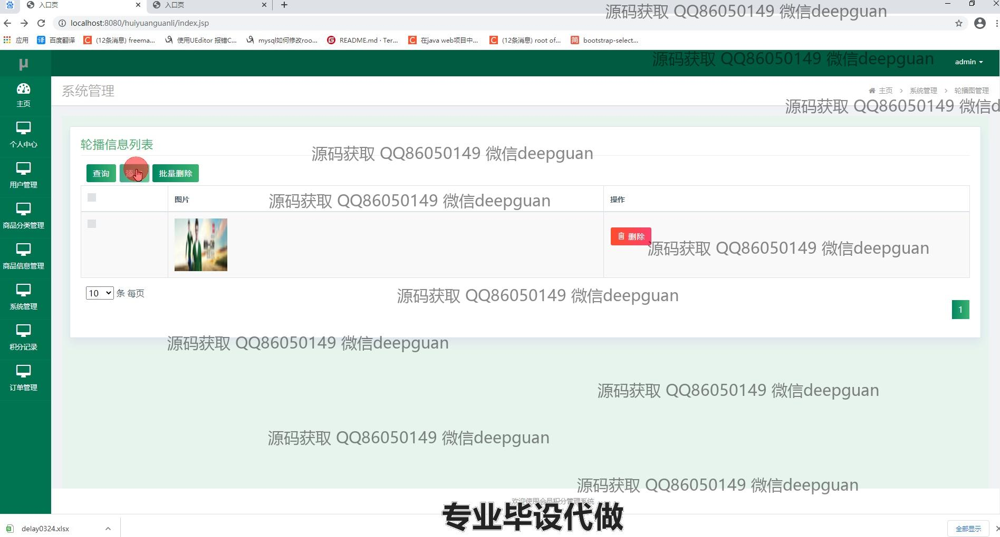
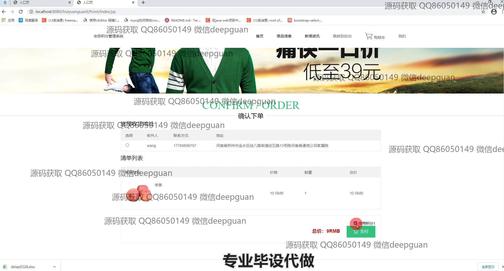

<h1 align="center">会员管理系统</h1>

## 简介
会员管理系统：提供用户管理、商品管理、订单管理、积分管理及多种支付方式，支持用户注册、登录和信息维护，方便管理员操作和综合管理。    --计算机毕业设计源码；毕设源码；java毕业设计源码

## 联系方式

<h3 align="center">获取完整代码与数据库文件 + 微信：deepguan QQ: 86050149 QQ群: 783742310</h3>

<h3 align="center">可帮忙远程部署 包运行成功！提供远程部署、修改代码、设计文档指导、代码讲解等服务！</h3>

## 功能介绍（完整见运行截图）
管理员：支持登录、注册、退出等基础功能；可通过导航栏管理用户信息、商品分类、商品详情、订单、积分记录及系统配置；提供订单状态更新、库存调整、商品上下架及批量操作功能；支持充值及多种支付方式设置，方便用户账户管理。

用户：可进行注册、登录及个人信息修改；浏览商品列表，查看商品详情，选择加入购物车或进行积分兑换；支持订单查看、支付及确认收货操作；通过个人中心管理订单、地址及积分记录，方便查询账户相关数据。

会员：享有查看个人积分变动记录、订单状态及历史记录的权限；可使用积分兑换商品，选择支付方式完成交易；管理个人账户余额及充值功能，保障账户使用顺畅。

系统管理员：负责维护系统的正常运行，包括新增、修改、删除会员或商品信息；支持后台订单处理及投诉回复；可管理权限设置，确保数据安全及系统功能优化。

## 运行截图

本代码来源于网络,仅供学习参考使用!

